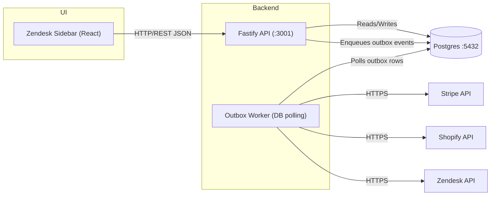

# ARCHITECTURE

This document describes the high-level architecture for `support_overlay` (IRIL: Issue Resolution Integrity Layer): a Zendesk sidebar UI, a Fastify API, a DB-backed outbox worker, PostgreSQL persistence, and provider connectors.

## Components

- Zendesk Sidebar: React UI embedded in Zendesk for agent-facing resolution workflows.
- Backend API (Fastify/Node): REST endpoints, policy checks, approval orchestration, and persistence.
- Outbox Worker: polls pending actions from PostgreSQL and executes third-party calls with retry and idempotency controls.
- PostgreSQL: source of truth for issues, policies, approvals, outbox, and audit log.
- Connectors: adapter-style integrations for Zendesk, Stripe, and Shopify.
- GitHub: source control, pull-request workflow, and CI automation.

## Data Flows And Ports

- Sidebar -> API: HTTP/REST JSON (default API port: `3001`).
- API <-> PostgreSQL: Postgres protocol (`5432`, host override via `POSTGRES_PORT`).
- API -> Outbox: transactional DB writes to `outbox_messages`.
- Worker -> Third parties: HTTPS calls to Zendesk, Stripe, and Shopify APIs.
- API -> Sidebar: polling-based card refresh (current design).

## Mermaid Diagram

## Diagram Notes

- The outbox pattern is used for safer side effects and retry handling.
- Stripe actions should use idempotency keys whenever applicable.
- Secrets must remain in runtime environment variables and never be committed.

## Artifacts

- Mermaid source: `docs/architecture.mmd`
- Rendered PNG: `docs/architecture-diagram.png`
- Demo GIF placeholder: `docs/demo-workflow.gif`
- Generation helper: `docs/generate-diagrams.sh`
